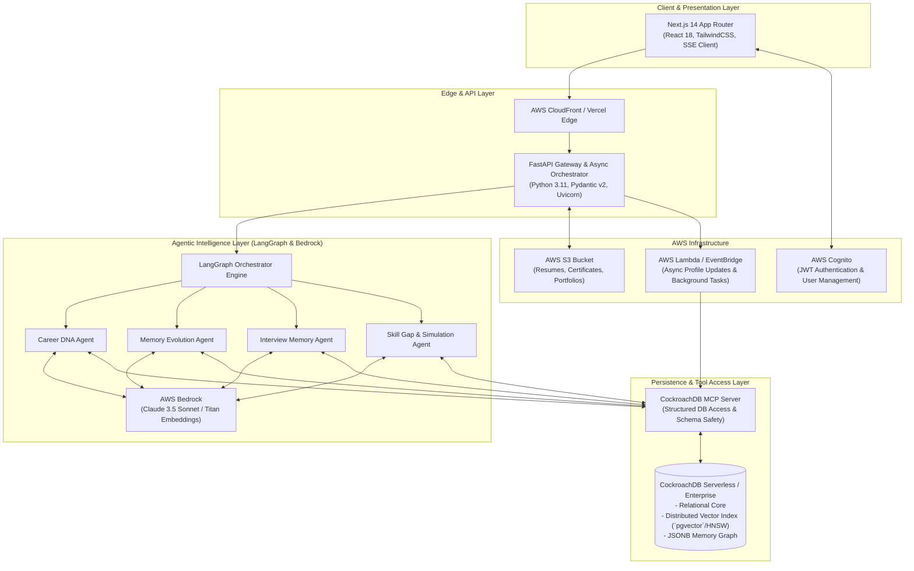
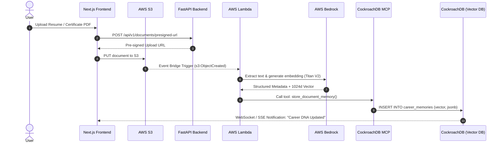
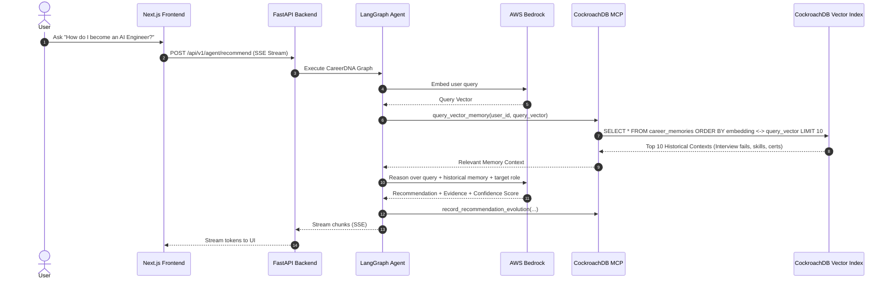
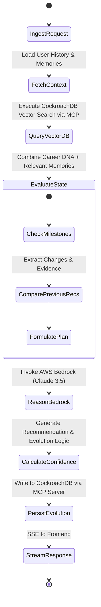
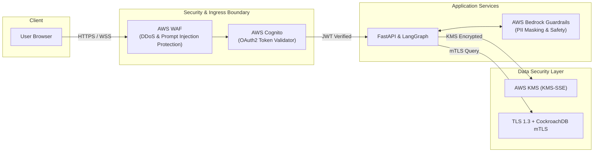
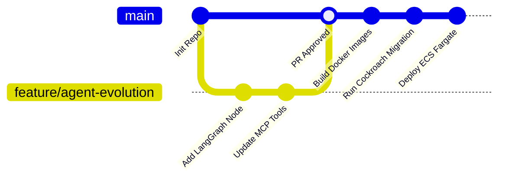

# System Architecture Document: CareerDNA AI

**Author**: Principal Software Architect  
**Version**: 1.0.0  
**Status**: Production-Ready Design  
**Date**: August 4, 2026  

---

## Executive Summary

**CareerDNA AI** is a state-of-the-art lifelong AI Career Agent platform engineered to continuously capture, analyze, and evolve user career profiles. Unlike traditional stateless conversational bots, CareerDNA AI utilizes a persistent memory architecture powered by **CockroachDB (Distributed SQL with Vector Indexing)** and **LangGraph**, combined with **AWS Bedrock** foundation models and **CockroachDB Model Context Protocol (MCP) Server** integration for secure, dynamic agent tool execution.

---

## 1. High-Level System Architecture



---

## 2. Core Components & Responsibilities

### 2.1 Frontend Layer (Next.js 14+)
- **Tech Stack**: Next.js App Router, TypeScript, TailwindCSS, Framer Motion, TanStack Query, React SSE streams.
- **Responsibilities**:
  - Interactive UI for Career Timeline, Career DNA Graph, Simulation Workbench, and Real-time Recommendation Evolution view.
  - Client-side token validation via AWS Cognito (Amplify SDK).
  - Server-Sent Events (SSE) streaming for real-time AI thought process and recommendation generation.

### 2.2 Backend & API Gateway (FastAPI)
- **Tech Stack**: Python 3.11, FastAPI, AsyncIO, Pydantic v2, HTTPX.
- **Responsibilities**:
  - Enterprise REST and SSE stream management.
  - Middleware for JWT verification, rate limiting, request tracing (OpenTelemetry), and CORS.
  - S3 pre-signed URL generation for secure document uploads.
  - Invocation of LangGraph execution pipelines.

### 2.3 Agentic Framework (LangGraph)
- **Tech Stack**: LangGraph, LangChain Core, AWS Bedrock API (`langchain-aws`).
- **Responsibilities**:
  - Stateful graph workflow management (Nodes, Edges, Conditional Routing).
  - Memory reflection, evidence extraction, confidence scoring, and decision evolution.
  - Tool calling execution through the **CockroachDB MCP Server**.

### 2.4 Database & Vector Memory (CockroachDB)
- **Tech Stack**: CockroachDB v24+, Distributed Vector Search (`vector` type with HNSW indexing), JSONB.
- **Responsibilities**:
  - **Relational Persistence**: Users, Resumes, Certificates, Interviews, Reflection Logs.
  - **Vector Memory (Semantic Search)**: Embeddings of user milestones, past failures, interview Q&As, and course outcomes for RAG retrieval.
  - **ACID Transactions**: High availability and multi-region resilience across distributed clusters.

### 2.5 CockroachDB MCP Server
- **Tech Stack**: Model Context Protocol (MCP) Python/Node SDK.
- **Responsibilities**:
  - Exposes standardized tools to LangGraph agents (`search_career_memory`, `insert_milestone`, `fetch_skill_graph`, `update_recommendation_history`).
  - Enforces schema safety, sql injection prevention, and tenant boundary verification before executing queries against CockroachDB.

### 2.6 AWS Cloud Infrastructure
- **Amazon Bedrock**: Serves Claude 3.5 Sonnet for complex career reasoning and Amazon Titan Text Embeddings V2 for vector memory indexing.
- **AWS S3**: Secure object storage for resumes, portfolio attachments, and certificates with KMS encryption.
- **AWS Cognito**: OAuth2 / OIDC authentication issuer and user identity management.
- **AWS Lambda & EventBridge**: Async workers for asynchronous background tasks (weekly reflection dispatch, asynchronous document parsing, GitHub webhook ingestion).

---

## 3. Data Flow Architecture

### 3.1 Career Memory Ingestion & Vector Indexing Flow



### 3.2 Dynamic Recommendation Evolution Flow



---

## 4. Database Schema & CockroachDB Vector Indexing

```sql
-- Enable Vector Search Extension in CockroachDB
CREATE EXTENSION IF NOT EXISTS vector;

-- User Profile Table
CREATE TABLE users (
    id UUID PRIMARY KEY DEFAULT gen_random_uuid(),
    cognito_sub VARCHAR(255) UNIQUE NOT NULL,
    email VARCHAR(255) UNIQUE NOT NULL,
    full_name VARCHAR(255) NOT NULL,
    current_title VARCHAR(255),
    target_role VARCHAR(255),
    created_at TIMESTAMPTZ DEFAULT now(),
    updated_at TIMESTAMPTZ DEFAULT now()
);

-- Structured Career DNA Profile
CREATE TABLE career_dna (
    id UUID PRIMARY KEY DEFAULT gen_random_uuid(),
    user_id UUID UNIQUE NOT NULL REFERENCES users(id) ON DELETE CASCADE,
    technical_skills JSONB DEFAULT '[]'::jsonb,
    soft_skills JSONB DEFAULT '[]'::jsonb,
    known_weaknesses JSONB DEFAULT '[]'::jsonb,
    career_goals JSONB DEFAULT '[]'::jsonb,
    dna_score INT DEFAULT 50,
    growth_velocity FLOAT DEFAULT 1.0,
    updated_at TIMESTAMPTZ DEFAULT now()
);

-- Distributed Vector Memory Table for Semantic Retrieval
CREATE TABLE career_memories (
    id UUID PRIMARY KEY DEFAULT gen_random_uuid(),
    user_id UUID NOT NULL REFERENCES users(id) ON DELETE CASCADE,
    memory_type VARCHAR(50) NOT NULL, -- 'RESUME', 'INTERVIEW_FAIL', 'CERTIFICATE', 'REFLECTION', 'PROJECT'
    content TEXT NOT NULL,
    metadata JSONB NOT NULL DEFAULT '{}'::jsonb,
    embedding VECTOR(1024) NOT NULL, -- AWS Titan Embeddings V2 1024-dim
    created_at TIMESTAMPTZ DEFAULT now()
);

-- Create HNSW Vector Index on CockroachDB for Sub-50ms Retrieval
CREATE INDEX idx_career_memories_vector ON career_memories 
USING hnsw (embedding vector_cosine_ops) 
WITH (m = 16, ef_construction = 64);

-- Index for User Filtering
CREATE INDEX idx_career_memories_user_type ON career_memories (user_id, memory_type);

-- Interview Memory Table
CREATE TABLE interview_memories (
    id UUID PRIMARY KEY DEFAULT gen_random_uuid(),
    user_id UUID NOT NULL REFERENCES users(id) ON DELETE CASCADE,
    company_name VARCHAR(255) NOT NULL,
    role_title VARCHAR(255) NOT NULL,
    interview_date DATE NOT NULL,
    result VARCHAR(50) NOT NULL, -- 'PASSED', 'FAILED', 'PENDING'
    questions_asked JSONB DEFAULT '[]'::jsonb,
    weak_areas JSONB DEFAULT '[]'::jsonb,
    feedback TEXT,
    created_at TIMESTAMPTZ DEFAULT now()
);

-- Recommendation Evolution Audit Log
CREATE TABLE recommendation_logs (
    id UUID PRIMARY KEY DEFAULT gen_random_uuid(),
    user_id UUID NOT NULL REFERENCES users(id) ON DELETE CASCADE,
    prompt TEXT NOT NULL,
    previous_recommendation TEXT,
    new_recommendation TEXT NOT NULL,
    why_changed TEXT NOT NULL,
    evidence_used JSONB NOT NULL,
    confidence_score FLOAT NOT NULL,
    created_at TIMESTAMPTZ DEFAULT now()
);
```

---

## 5. LangGraph Agent State Machine Architecture



### LangGraph Agent Toolset Definition (via CockroachDB MCP)

```python
# app/agents/tools/mcp_tools.py
from langchain_core.tools import tool
import httpx

MCP_SERVER_URL = "http://cockroach-mcp-server:8000/mcp/v1/exec"

@tool
async def fetch_vector_career_memory(user_id: str, query_text: str, top_k: int = 5) -> str:
    """Retrieves semantic career memories (past interview failures, courses, skills) from CockroachDB."""
    async with httpx.AsyncClient() as client:
        response = await client.post(
            f"{MCP_SERVER_URL}/query_memory",
            json={"user_id": user_id, "query": query_text, "top_k": top_k}
        )
        return response.text

@tool
async def update_career_dna(user_id: str, skill_updates: dict, weaknesses: list) -> str:
    """Updates the user's persistent Career DNA metrics in CockroachDB via MCP server."""
    async with httpx.AsyncClient() as client:
        response = await client.post(
            f"{MCP_SERVER_URL}/update_dna",
            json={"user_id": user_id, "skills": skill_updates, "weaknesses": weaknesses}
        )
        return response.text
```

---

## 6. Directory / Folder Structure

```
careerdna-ai/
├── docker-compose.yml
├── README.md
├── ARCHITECTURE.md
├── PRD.md
├── frontend/                     # Next.js 14 Application
│   ├── package.json
│   ├── next.config.mjs
│   ├── tailwind.config.ts
│   ├── src/
│   │   ├── app/                  # App Router
│   │   │   ├── layout.tsx
│   │   │   ├── page.tsx
│   │   │   ├── dashboard/
│   │   │   ├── timeline/
│   │   │   ├── simulation/
│   │   │   └── api/              # Next API Routes (BFF)
│   │   ├── components/           # UI Components
│   │   │   ├── timeline/
│   │   │   ├── dna-graph/
│   │   │   ├── recommendations/
│   │   │   └── ui/               # Design Tokens & Elements
│   │   ├── lib/                  # Auth & API Utilities
│   │   └── hooks/                # Custom React Hooks (useSSE, useAuth)
├── backend/                      # FastAPI Backend Gateway
│   ├── pyproject.toml
│   ├── Dockerfile
│   ├── main.py
│   ├── app/
│   │   ├── api/                  # API Endpoints
│   │   │   ├── v1/
│   │   │   │   ├── auth.py
│   │   │   │   ├── documents.py
│   │   │   │   ├── agent.py
│   │   │   │   └── timeline.py
│   │   ├── core/                 # Config & Security
│   │   │   ├── config.py
│   │   │   ├── security.py
│   │   │   └── cognito.py
│   │   ├── services/             # AWS Bedrock & S3 Services
│   │   │   ├── bedrock_service.py
│   │   │   └── s3_service.py
│   │   └── db/                   # Direct DB Engine Connection
│   │       └── cockroach.py
├── agents/                       # LangGraph Agent Core
│   ├── pyproject.toml
│   ├── Dockerfile
│   ├── src/
│   │   ├── graph.py              # Main LangGraph Definition
│   │   ├── nodes/                # Execution Nodes
│   │   │   ├── memory_node.py
│   │   │   ├── reasoning_node.py
│   │   │   └── evolution_node.py
│   │   ├── tools/                # CockroachDB MCP Client Tools
│   │   │   └── mcp_tools.py
│   │   └── state.py              # Agent State Pydantic Schema
├── mcp-server/                   # CockroachDB MCP Server
│   ├── Dockerfile
│   ├── server.py                 # FastMCP Server Implementation
│   ├── db_driver.py              # CockroachDB asyncpg pool
│   └── tools_registry.py         # Standardized MCP Tool Definitions
└── infra/                        # Infrastructure as Code
    ├── terraform/                # Terraform Modules
    │   ├── cockroachdb.tf
    │   ├── aws_bedrock.tf
    │   ├── aws_cognito.tf
    │   ├── aws_s3.tf
    │   └── ecs_cluster.tf
```

---

## 7. API Specifications & Contracts

### 7.1 Recommendation Evolution Stream (SSE)
- **Endpoint**: `POST /api/v1/agent/recommend`
- **Headers**: `Authorization: Bearer <Cognito_JWT>`, `Content-Type: application/json`

#### Request Payload
```json
{
  "query": "How do I transition from Fullstack Developer to AI Engineer?",
  "target_role": "AI Engineer",
  "simulation_mode": false
}
```

#### Response Stream (Server-Sent Events)
```json
data: {"type": "MEMORY_RETRIEVED", "memories_count": 4, "key_events": ["Failed AWS ML Specialty Mock (2026-07)", "Completed PyTorch Basics (2026-08)"]}

data: {"type": "REASONING", "thought": "Analyzing gap between Fullstack & AI Engineer considering interview failure in AWS ML..."}

data: {"type": "RECOMMENDATION_CHUNK", "text": "Focus heavily on Vector DBs and LangGraph first. Your previous mock interview showed weakness in model deployment..."}

data: {"type": "EVOLUTION_METADATA", "why_changed": "Updated recommendations reflect recent completion of PyTorch basics and past AWS ML interview weaknesses.", "confidence_score": 0.92, "evidence": ["memory_id_882", "memory_id_991"]}

data: {"type": "DONE"}
```

---

## 8. Security, Governance & Compliance



1. **Authentication & Authorization**: AWS Cognito OAuth2 user pools with JWT validation at backend API gateways. Tenant isolation enforced by embedding `user_id` checks in every SQL/Vector lookup inside the CockroachDB MCP Server.
2. **AI Safety & Guardrails**: AWS Bedrock Guardrails enabled to prevent prompt injection attacks, redact personally identifiable information (PII) before LLM reasoning, and filter out hallucinatory content.
3. **Data Encryption**:
   - **At Rest**: CockroachDB transparent data encryption (TDE) & AWS S3 KMS-managed keys (SSE-KMS).
   - **In Transit**: Mandatory TLS 1.3 across external network interfaces and mutual TLS (mTLS) between backend microservices and CockroachDB clusters.
4. **Audit Logging**: Every agent action, recommendation evolution change, and MCP tool execution is recorded with timestamp and signature in `recommendation_logs`.

---

## 9. Deployment & Operations Architecture

### 9.1 Multi-Region Production Infrastructure

- **Frontend Deployment**: Deployed to Vercel Enterprise or AWS CloudFront + S3 static origin with global edge distribution.
- **Backend & LangGraph Agents**: Deployed on AWS ECS Fargate (Auto-scaling tasks based on CPU/Memory load and active SSE client connections).
- **Database Layer**: CockroachDB Serverless or Dedicated Cluster provisioned across 3 availability zones for 99.999% SLA availability and automated failover.
- **MCP Server Service**: Dedicated internal ECS task isolated within private AWS VPC subnets.

### 9.2 CI/CD Pipeline Flow



1. **Automated Testing**: Pytest suite for API & LangGraph nodes, Playwright E2E tests for Next.js flow.
2. **Database Migrations**: Managed via `golang-migrate` or `Alembic` pipelines connecting securely to CockroachDB.
3. **Observability**: AWS CloudWatch + OpenTelemetry tracing tracing requests from API endpoint -> LangGraph state transitions -> CockroachDB MCP vector queries -> Bedrock latency.
