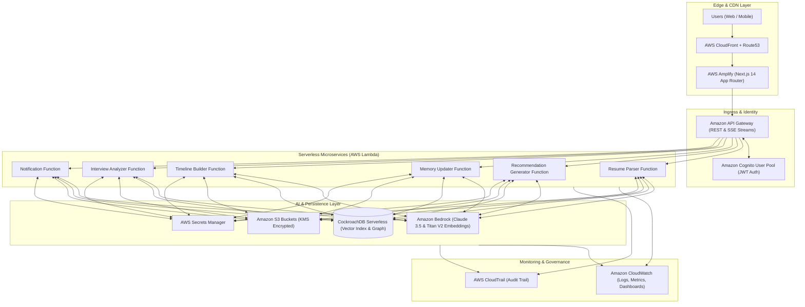
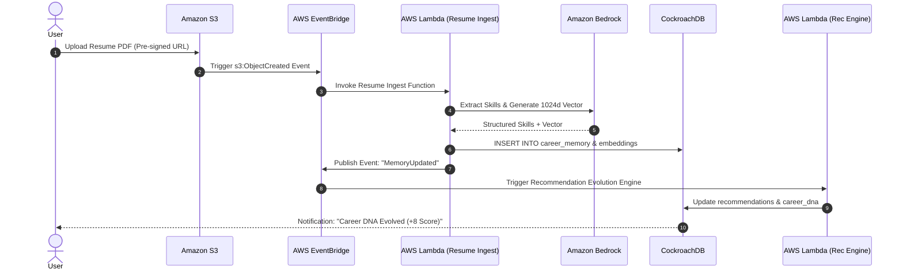

# AWS Infrastructure Architecture: CareerDNA AI

**Platform**: CareerDNA AI  
**Architecture Type**: Event-Driven, Serverless, AI-Native Platform  
**IaC Tooling**: Terraform / AWS CDK  
**Author**: Principal Cloud & AI Infrastructure Architect  
**Status**: Production Ready  

---

## 1. High-Level System Topology



---

## 2. Core AWS Service Specifications

### 2.1 Amazon Bedrock (Intelligence & Reasoning Engine)
- **Role**: Serves as the foundation model execution engine for recommendation generation, resume parsing, skill gap analysis, interview coaching, and memory evolution.
- **Models Used**:
  - **Claude 3.5 Sonnet**: Complex career reasoning, explainable recommendation updates, and mock interview feedback.
  - **Amazon Titan Text Embeddings V2**: Generating 1024-dimensional vector embeddings for memory chunks stored in CockroachDB.

### 2.2 AWS Lambda (Microservices Compute)
Dedicated, single-responsibility serverless functions:
- `resume-service`: Ingests S3 resume PDFs, parses text via Bedrock, and triggers memory creation.
- `recommendation-service`: Executes stateful LangGraph workflows to generate evidence-backed recommendations.
- `memory-service`: Handles decay score recalculation, duplicate merging, and conflict resolution.
- `timeline-service`: Builds real-time milestone feeds.
- `interview-service`: Ingests Q&A logs and updates weakness matrices.
- `notification-service`: Dispatches proactive alerts and triggers weekly reflection prompts.

### 2.3 Amazon S3 (Document Persistence)
- `careerdna-resumes`: Store resume PDF versions.
- `careerdna-portfolios`: Store portfolio attachments and project files.
- `careerdna-certificates`: Store uploaded completion certificates.
- **Security**: Private access default, KMS server-side encryption (SSE-KMS), presigned URLs for client uploads, bucket versioning enabled.

### 2.4 AWS Secrets Manager
- Securely stores database connection strings (`COCKROACH_DATABASE_URL`), JWT signing keys, and external integration API keys.

---

## 3. Event-Driven Workflow Architecture



---

## 4. Infrastructure as Code (Terraform Layout)

```
infra/
├── terraform/
│   ├── main.tf                 # Primary provider & module declaration
│   ├── variables.tf            # Environment & VPC settings
│   ├── outputs.tf              # Endpoints & KMS Key ARNs
│   ├── modules/
│   │   ├── cognito/            # User Pools & Client configuration
│   │   ├── s3/                 # Encrypted document buckets
│   │   ├── lambda/             # Serverless backend functions
│   │   ├── api_gateway/        # REST & SSE stream endpoints
│   │   ├── bedrock/            # Guardrails & IAM role bindings
│   │   └── secrets/            # Secrets Manager definitions
```

---

## 5. Security & Compliance Controls

1. **Authentication & Authorization**: AWS Cognito User Pools with OAuth2 / OIDC JWT verification enforced at API Gateway authorizers.
2. **Data Encryption**:
   - **At Rest**: AES-256 via KMS customer-managed keys (CMK) across S3, Secrets Manager, and CloudWatch logs.
   - **In Transit**: Mandatory TLS 1.3 for API Gateway and SSL mTLS for CockroachDB database traffic.
3. **IAM Least Privilege**: Each Lambda function is assigned a dedicated IAM role with explicit permission policies (e.g. `resume-service` can only read from `careerdna-resumes` bucket).

---

## 6. Observability & Monitoring Dashboards

### CloudWatch Dashboards Configured:
- **API Health Dashboard**: Requests/sec, P95/P99 latency, 4xx/5xx error rates.
- **Lambda Performance Dashboard**: Invocations, duration, cold-start metrics, retry counts.
- **Bedrock AI Dashboard**: Token usage, model invocation latency, throttling errors, response times.
- **CareerDNA Metrics Dashboard**: Active memory updates, recommendation evolutions, weekly reflection completion rates.

---

## 7. Disaster Recovery & Cost Optimization

- **Disaster Recovery SLA**:
  - **RTO (Recovery Time Objective)**: $< 30$ minutes (Automated Terraform multi-region deployment).
  - **RPO (Recovery Point Objective)**: $< 5$ minutes (CockroachDB multi-region automated replication + S3 cross-region versioning).
- **Cost Optimization**:
  - **Bedrock**: Prompt caching enabled, long memories summarized before model reasoning.
  - **Lambda**: Compute memory tuned (512MB default), stateless execution context reuse.
  - **S3**: Lifecycle rules transitioning resumes $> 90$ days to S3 Standard-IA.
