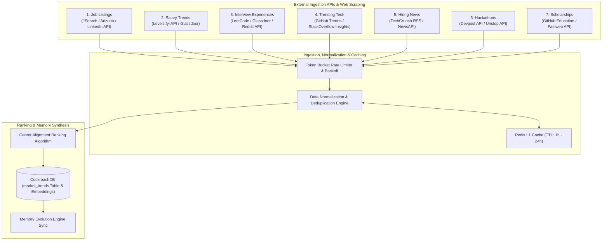

# Real-Time Career Intelligence Module Architecture

**Platform**: CareerDNA AI  
**Component**: Real-Time Career Intelligence & Signal Processing Pipeline  
**Author**: Principal Data & AI Systems Architect  
**Status**: Production Ready  

---

## 1. Module Overview & Data Sources

The **Real-Time Career Intelligence Module** continuously ingests, normalizes, ranks, and synthesizes 7 live external market signals to ensure user recommendations stay synchronized with the fast-evolving tech landscape.



---

## 2. API Sources & Selection Matrix

| Data Stream | Primary API Source | Backup Source | Ingestion Frequency |
|---|---|---|---|
| **1. Job Listings** | JSearch API (RapidAPI) | Adzuna API / RemoteOK API | Every 6 Hours |
| **2. Salary Trends** | Levels.fyi Public API | Glassdoor API / Payscale | Every 24 Hours |
| **3. Interview Experiences** | Reddit API (`r/cscareerquestions`) | LeetCode Discuss Scraping | Every 12 Hours |
| **4. Trending Tech** | GitHub Trending API (`/search/repositories`) | Stack Overflow API | Every 12 Hours |
| **5. Hiring News** | NewsAPI (`/v2/everything?q=hiring`) | TechCrunch RSS Feeds | Every 3 Hours |
| **6. Hackathons** | Devpost Public API | Unstop API | Daily |
| **7. Scholarships** | GitHub Student Developer Pack API | Fastweb Scraping | Weekly |

---

## 3. Rate Limiting, Caching & Scheduling Strategy

### 3.1 Rate Limiting Architecture
To prevent API IP bans and minimize external API costs, the ingestion pipeline implements a **Redis Token Bucket Rate Limiter**:
- **JSearch API**: 100 requests / minute max.
- **NewsAPI**: 1,000 requests / day limit.
- **GitHub API**: 5,000 requests / hour (Authenticated with Personal Access Token).

### 3.2 Multi-Tier Caching
- **L1 Cache (In-Memory Redis)**: Caches normalized search results for identical queries (TTL: 1 hour for news, 6 hours for job listings, 24 hours for salary benchmarks).
- **L2 Storage (CockroachDB `market_trends` Table)**: Stores processed, aggregated weekly intelligence for persistent RAG retrieval by LangGraph agents.

### 3.3 EventBridge Cron Scheduling
- Ingestion jobs are triggered asynchronously via **AWS EventBridge** rule definitions calling **AWS Lambda** ingest worker functions.

---

## 4. Data Normalization Schema & Pipeline

All raw heterogeneous payloads are converted into a unified **CareerIntelligenceSignal** schema:

```python
from pydantic import BaseModel, Field
from typing import List, Dict, Any, Optional

class CareerIntelligenceSignal(BaseModel):
    signal_id: str
    stream_category: str  # 'JOB_LISTING', 'SALARY_TREND', 'INTERVIEW_EXP', 'TRENDING_TECH', 'HIRING_NEWS', 'HACKATHON', 'SCHOLARSHIP'
    title: str
    summary: str
    organization: Optional[str]
    target_roles: List[str]
    extracted_skills: List[str]
    location: Optional[str]
    compensation_usd: Optional[float]
    event_date: Optional[str]
    source_url: str
    raw_payload: Dict[str, Any]
    relevance_score: float = 0.0
    ingested_at: str
```

---

## 5. Intelligence Ranking Algorithm

When presenting live career signals to a user, signals are scored using a weighted multi-factor ranking formula:

$$\text{Score} = w_1 \cdot \text{VectorSim}(\mathbf{u}_{\text{dna}}, \mathbf{v}_{\text{signal}}) + w_2 \cdot \text{SkillMatch} + w_3 \cdot \text{FreshnessDecay} + w_4 \cdot \text{ImpactScore}$$

Where:
- $w_1 = 0.40$ (Semantic match between user Career DNA vector and signal embedding)
- $w_2 = 0.30$ (Overlap percentage between user's missing target skills and signal skills)
- $w_3 = 0.15$ ($e^{-\lambda \cdot t_{\text{hours}}}$, where $\lambda = 0.02$)
- $w_4 = 0.15$ (Signal authority rating, e.g. FAANG hiring news = $1.0$, unknown blog = $0.3$).

---

## 6. Memory Evolution & Recommendation Synchronization

1. **Memory Trigger**: When a high-impact intelligence signal occurs (e.g. "Google announces hiring freeze on Mid-level, pivoting to Senior AI Engineers"), the module generates a `MARKET_SHIFT` event.
2. **CockroachDB Storage**: The signal is written to `market_trends` and embedded into `embeddings`.
3. **LangGraph Notification**: The `Skill Gap Analyzer` and `Recommendation Generator` nodes read these market shifts during prompt execution to dynamically adapt roadmaps.
