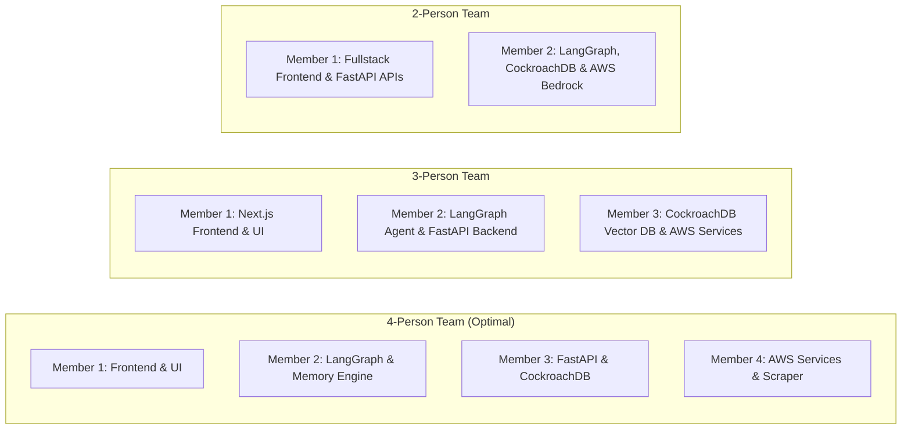

# Team Task Division & Hackathon Execution Strategy: CareerDNA AI

**Project**: CareerDNA AI  
**Goal**: Divide and conquer tasks for a 2 to 4-person team to build, integrate, and present CareerDNA AI in a 24–48 hour hackathon sprint.  
**Author**: Principal Engineering Lead  
**Status**: Ready for Team Assignment  

---

## 1. Modular Role Breakdown

### 👤 Member 1: Frontend & UI/UX Engineer (Next.js & Design System)
**Primary Responsibility**: Build the user-facing web dashboard based on the [`DESIGN_SYSTEM.md`](file:///c:/Users/omkh4/Downloads/CareerDNA%20AI/DESIGN_SYSTEM.md) specification.

#### Key Deliverables:
1. **Layout & Navigation**:
   - Fixed Sidebar + Sticky Blur Topbar + Mobile Navigation Drawer.
   - Theme provider & design tokens (Slate dark theme `#020617`, `#0F172A`, `#3B82F6` primary blue).
2. **Core Pages**:
   - **Command Center (Dashboard)**: Hero score counter (`87 ↑ +3`), AI confidence matrix (94%), decision engine card, trajectory area chart.
   - **Career DNA Page**: 6-trait radar chart (Problem Solving, Technical Depth, etc.) & strength/weakness pills.
   - **Memory Timeline**: Chronological vertical milestone feed with confidence badges.
   - **Memory Graph Page**: Interactive SVG / Canvas network graph visualizing memory nodes and relationships.
   - **Applications Kanban**: Drag-and-drop / column layout (`Applied` $\rightarrow$ `Interviewing` $\rightarrow$ `Offer`).
3. **Real-Time SSE Client Integration**:
   - Stream real-time AI reasoning tokens, evidence tags, and confidence updates from the FastAPI endpoint.

---

### 👤 Member 2: AI & LangGraph Agent Engineer (Agentic Engine & Memory)
**Primary Responsibility**: Implement the LangGraph agent state machine and Memory Evolution Engine.

#### Key Deliverables:
1. **10 LangGraph Graph Nodes** ([`agent_graph.py`](file:///c:/Users/omkh4/Downloads/CareerDNA%20AI/agent_graph.py)):
   - Ingest: `resume_analyzer_node`, `memory_retriever_node`, `market_analyzer_node`, `skill_gap_analyzer_node`.
   - Dynamic Branches: `recommendation_generator_node`, `learning_planner_node`, `interview_coach_node`.
   - Convergence: `memory_evolution_node`, `memory_writer_node`, `notification_engine_node`.
2. **Intent Router**:
   - Conditional routing logic based on user execution mode (`RECOMMENDATION`, `LEARNING_PLAN`, `MOCK_INTERVIEW`).
3. **Memory Evolution Engine** ([`memory_evolution.py`](file:///c:/Users/omkh4/Downloads/CareerDNA%20AI/memory_evolution.py)):
   - Implement Ebbinghaus decay score calculation formula $S(t) = \min(1.0, I \cdot C \cdot (1 + \beta \ln F) e^{-\lambda t})$.
   - Cosine similarity vector duplicate merging (threshold $> 0.92$).
   - Conflict detection (Failed vs Passed) & relationship graph edge writing.

---

### 👤 Member 3: Database & Backend Engineer (CockroachDB & FastAPI)
**Primary Responsibility**: Manage CockroachDB persistent storage, schema migrations, and FastAPI REST/SSE endpoints.

#### Key Deliverables:
1. **CockroachDB Schema & Vectors** ([`schema.sql`](file:///c:/Users/omkh4/Downloads/CareerDNA%20AI/schema.sql)):
   - Deploy 20 core tables (`users`, `profiles`, `career_memory`, `embeddings`, `interview_history`, etc.).
   - Enable `vector` extension and configure `idx_embeddings_hnsw` vector index.
2. **CockroachDB MCP Server**:
   - Stand up the MCP server exposing database tools (`mcp_query_vector_memory_tool`, `mcp_insert_career_memory_tool`, `mcp_log_recommendation_evolution_tool`).
3. **FastAPI Gateway & SSE Endpoints**:
   - `POST /api/v1/agent/recommend` (Server-Sent Events streaming).
   - `POST /api/v1/documents/presigned-url` (AWS S3 presigned upload generation).
   - `GET /api/v1/timeline` & `GET /api/v1/dna` endpoints.

---

### 👤 Member 4: AWS Infrastructure & Real-Time Data Engineer (AWS & Scrapers)
**Primary Responsibility**: Configure AWS services, Bedrock model access, authentication, and the 7-stream Career Intelligence pipeline.

#### Key Deliverables:
1. **AWS Bedrock & Cognito**:
   - Configure AWS Bedrock API client for Claude 3.5 Sonnet & Amazon Titan Text Embeddings V2 (1024d).
   - Setup AWS Cognito User Pool & app client for user signup/login.
2. **Real-Time Career Intelligence Module** ([`career_intelligence.py`](file:///c:/Users/omkh4/Downloads/CareerDNA%20AI/career_intelligence.py)):
   - Connect 7 data streams: Job Listings, Salary Trends, Interview Experiences, Trending Tech, Hiring News, Hackathons, Scholarships.
   - Implement Token Bucket Rate Limiter & multi-factor signal ranking formula.
3. **Terraform IaC & S3 Buckets**:
   - Provision `careerdna-resumes-production` bucket with KMS encryption.
   - Apply Terraform configuration ([`infra/terraform/main.tf`](file:///c:/Users/omkh4/Downloads/CareerDNA%20AI/infra/terraform/main.tf)).

---

## 2. Team Size Adaptation Matrix



---

## 3. Hackathon Execution Timeline (48-Hour Sprint)

```
[ Hours 00 - 06 ]  Setup & Architecture Sync
                   • CockroachDB cluster initialization & schema.sql run
                   • AWS Cognito & S3 bucket provisioning
                   • Next.js app initialization & design tokens setup

[ Hours 06 - 18 ]  Core Feature Development
                   • Member 1: Build Dashboard, Career DNA & Timeline UI
                   • Member 2: Implement 10 LangGraph nodes & Memory Evolution
                   • Member 3: Stand up CockroachDB MCP Server & FastAPI SSE endpoint
                   • Member 4: Wire Bedrock Claude 3.5 Sonnet & Career Intelligence scraper

[ Hours 18 - 30 ]  System Integration & Streaming
                   • Connect Next.js frontend to FastAPI SSE recommendation stream
                   • Test S3 document upload -> Lambda parser -> CockroachDB vector insert
                   • Verify Memory Evolution Engine score decay & duplicate merging

[ Hours 30 - 40 ]  End-to-End Testing & Polish
                   • Execute 5-Minute Demo Flow (Upload resume -> Roadmaps -> Fail mock -> Evolve)
                   • Polish design system micro-interactions & glassmorphism UI

[ Hours 40 - 48 ]  Demo Preparation & Presentation
                   • Record demo video & prepare slide deck highlighting CockroachDB + AWS
                   • Practice WOW moments (Cross-device memory restore, Explainable AI)
```

---

## 4. Critical Integration Contracts

To prevent blocking each other, agree on these 3 API contracts immediately:

1. **SSE Stream Contract (`POST /api/v1/agent/recommend`)**:
   ```json
   data: {"type": "MEMORY_RETRIEVED", "count": 3, "key_events": ["Failed System Design"]}
   data: {"type": "RECOMMENDATION_CHUNK", "text": "Focus on LangGraph..."}
   data: {"type": "EVOLUTION_METADATA", "why_changed": "...", "confidence_score": 0.94}
   ```
2. **CockroachDB User ID Claim**:
   - Ensure all database queries append `WHERE user_id = :user_id` for multi-tenant security.
3. **Pre-signed Upload Contract (`POST /api/v1/documents/presigned-url`)**:
   - Returns `{ "upload_url": "https://s3.amazonaws.com/...", "s3_key": "resumes/user_123.pdf" }`.
