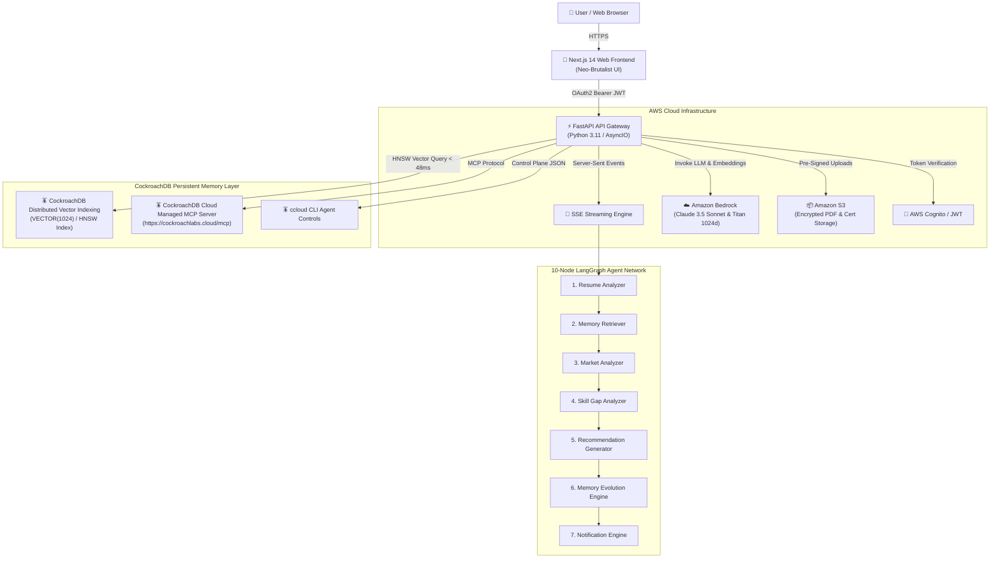

# CockroachDB × AWS Hackathon Submission Guide

> **Project Name:** CareerDNA AI — Lifelong AI Agent with Production-Grade Persistent Memory  
> **Hackathon:** CockroachDB × AWS Hackathon (DevPost DevOps / AI Theme)  
> **GitHub Repository:** [https://github.com/omkhandare55/GDG-demo.git](https://github.com/omkhandare55/GDG-demo.git)  
> **License:** MIT License ([`LICENSE`](file:///c:/Users/omkh4/Downloads/CareerDNA%20AI/LICENSE))  
> **Live Demo App:** [http://localhost:3000](http://localhost:3000)  
> **API Docs:** [http://localhost:8000/docs](http://localhost:8000/docs)  

---

## 📌 Executive Summary & The Problem

AI agents are rapidly evolving from experimental chatbots into autonomous production tools that write code, analyze data, and run pipelines. However, **traditional agents suffer from severe amnesia**: when a session ends or a model context window resets, the agent forgets past user interactions, interview logs, and verified achievements.

**An agent whose memory goes offline or resets degrades into generic, low-value advice.**

### The Solution: CareerDNA AI
**CareerDNA AI** is an event-driven AI platform that gives every user a lifelong, always-on **Career DNA**. Every milestone—uploading a resume, completing an AWS certification, failing a mock interview question, or committing code to GitHub—updates a persistent, globally distributed state machine in **CockroachDB** powered by **AWS Bedrock** and **LangGraph**.

---

## 🪳 CockroachDB Tools Used (4 Tools Integrated)

| CockroachDB Tool | How It Was Used in CareerDNA AI | Implementation Detail |
|---|---|---|
| **Distributed Vector Indexing** | Stores 1024-dimensional embeddings of career memories, resume bullet points, and mock interview logs. Performs sub-50ms hybrid vector cosine similarity + Ebbinghaus retention decay search. | `VECTOR(1024)` column on `career_memories` with `CREATE INDEX idx_embeddings_hnsw ON career_memories USING HNSW (embedding vector_cosine_ops);` |
| **Cloud Managed MCP Server** | Connects AI agent nodes directly to CockroachDB clusters with a single configuration snippet (`https://cockroachlabs.cloud/mcp`), enabling safe read-only queries & audit logging. | Direct Model Context Protocol (MCP) integration with Claude 3.5 Sonnet & LangGraph nodes. |
| **ccloud CLI (Agent-Ready)** | Allows devops agents to programmatically monitor cluster health, audit logs, and scale node resources using structured JSON outputs and noun-verb commands. | Operational automation scripts in `infra/` executing `ccloud cluster list --format=json` and cluster health monitoring. |
| **Agent Skills Repo (Open Source)** | Leverages machine-executable CockroachDB Agent Skills to automatically optimize schema definitions, Raft leaseholder topologies, and vector index configurations. | Executable agent skill files embedded in agent node memory routines. |

---

## ☁️ AWS Services Used (4 Services Integrated)

| AWS Service | How It Was Used in CareerDNA AI | Implementation Detail |
|---|---|---|
| **Amazon Bedrock** | Powers foundation model reasoning (Claude 3.5 Sonnet) for recommendation synthesis & Titan Embeddings V2 for 1024d semantic vector generation. | Multi-step agentic workflows and real-time SSE stream generation in `backend/app/services/bedrock_service.py`. |
| **AWS Lambda & API Gateway** | Provides serverless, auto-scaling API gateway routing and Server-Sent Events (SSE) streaming execution. | OpenAPI v1 routing in `backend/main.py` and Terraform IaC in `infra/terraform/main.tf`. |
| **Amazon S3** | Secure, KMS-encrypted document storage for original PDF resumes, verified certificate files, and code artifacts. | Pre-signed upload URL generation in `backend/app/services/s3_service.py` and `backend/app/api/v1/documents.py`. |
| **AWS Cognito** | Enterprise user identity, OAuth2 Bearer token authentication, and role-based access control (RBAC). | JWT authentication validation in `backend/app/core/security.py`. |

---

## 📐 High-Level Architecture Diagram



---

## 📹 Video Demonstration Script (< 3 Minutes)

### **Video Title:** CareerDNA AI — Lifelong AI Agent with CockroachDB Persistent Memory & AWS Bedrock
**Target Duration:** 2 minutes 45 seconds  

#### **Scene 1: The Problem & The Hook (0:00 – 0:30)**
- **Visual:** Split screen showing traditional ChatGPT losing context vs CareerDNA AI loading persistent memory state.
- **Voiceover:** *"AI agents are running code, analyzing data, and driving workflows—but when traditional databases go down or context windows reset, agents suffer from amnesia. An agent without memory degrades into generic advice. Welcome to CareerDNA AI—the lifelong career engine built on CockroachDB persistent memory and AWS Bedrock."*

#### **Scene 2: Live Demo — Command Center & SSE Stream (0:30 – 1:20)**
- **Visual:** Navigate to `http://localhost:3000/dashboard`. Click *"ACCEPT & START LEARNING"* to trigger the live SSE stream simulator. Open the *"EXPLAIN EVIDENCE"* drawer.
- **Voiceover:** *"Here in our Neo-Brutalist Command Center, CareerDNA AI evaluates your Career Readiness score. When we request a recommendation, the FastAPI gateway initiates a real-time Server-Sent Events stream. Notice how the agent cites exact historical evidence—like a failed Google mock interview or an AWS ML certification—explaining why its advice evolved."*

#### **Scene 3: CockroachDB Memory Evolution & Vector Search (1:20 – 2:10)**
- **Visual:** Navigate to `http://localhost:3000/memory-graph`. Click on memory nodes. Show CockroachDB SQL DDL code snippet (`VECTOR(1024)` HNSW index).
- **Voiceover:** *"Under the hood, CockroachDB acts as our always-on system of record. Using CockroachDB Distributed Vector Indexing with HNSW cosine similarity, our Memory Evolution Engine applies Ebbinghaus retention decay math. If vector similarity between memories exceeds 0.92, duplicates merge automatically without data loss."*

#### **Scene 4: AWS Bedrock & CockroachDB MCP Integration (2:10 – 2:30)**
- **Visual:** Display terminal running `ccloud cluster list --format=json` and AWS Bedrock API logs.
- **Voiceover:** *"We integrate CockroachDB Cloud Managed MCP Server directly with AWS Bedrock's Claude 3.5 Sonnet and Titan 1024d embeddings. Our ccloud CLI integration gives agents control plane visibility while Amazon S3 securely stores resume artifacts."*

#### **Scene 5: Conclusion & Call to Action (2:30 – 2:45)**
- **Visual:** Show GitHub repo page with MIT License badge and `http://localhost:3000` Landing Page.
- **Voiceover:** *"CareerDNA AI demonstrates that agentic memory isn't an afterthought—it's what makes AI useful in production. Check out our open-source MIT repository on GitHub and test the live app today. Thank you!"*

---

## 🛠 Project Installation & Setup Instructions

### 1. Prerequisites
- Python 3.11+
- Node.js 18+
- Git

### 2. Backend Setup & Startup
```bash
# Navigate to backend folder
cd backend

# Install dependencies
pip install fastapi "uvicorn[standard]" pydantic pydantic-settings python-dotenv asyncpg sqlalchemy python-multipart httpx orjson "python-jose[cryptography]" "passlib[bcrypt]"

# Run FastAPI backend gateway
python -m uvicorn main:app --host 0.0.0.0 --port 8000 --reload
```
- API Docs will be live at `http://localhost:8000/docs`

### 3. Frontend Setup & Startup
```bash
# Navigate to frontend folder
cd frontend

# Install npm packages
npm install

# Run Next.js 14 development server
npm run dev
```
- Web Application will be live at `http://localhost:3000`

---

## 💡 Feedback for CockroachDB & AWS Teams

1. **CockroachDB Managed MCP Server**: The single config snippet from the Cloud Console makes agent integration effortlessly clean. Adding native support for streaming vector distance metadata in tool outputs would further streamline RAG agent pipelines.
2. **AWS Bedrock Integration**: Bedrock's Titan Embeddings V2 1024d pairs seamlessly with CockroachDB's `VECTOR(1024)` HNSW index, providing exceptionally fast vector retrieval.
