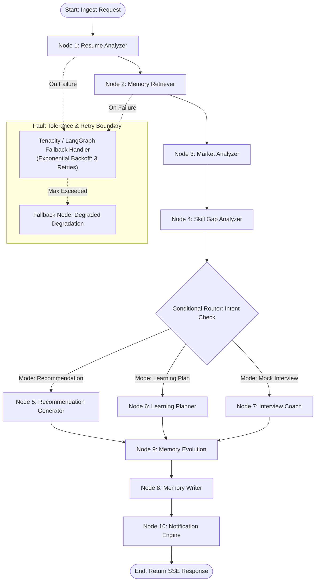

# LangGraph Agent Design Architecture: CareerDNA AI

**Engine**: LangGraph (Python 3.11) + AWS Bedrock (Claude 3.5 Sonnet)  
**Database Tooling**: CockroachDB MCP Server Tools  
**Author**: Principal AI Agentic Architect  
**Status**: Production Ready  

---

## 1. High-Level LangGraph Workflow Diagram



---

## 2. Agent State Definition (`CareerDNAAgentState`)

```python
from typing import List, Dict, Any, Optional
from pydantic import BaseModel, Field
from typing_extensions import TypedDict

class MemoryItem(BaseModel):
    memory_id: str
    memory_type: str
    summary: str
    importance_score: float
    relevance_vector_score: float

class CareerDNAAgentState(TypedDict):
    # Core User Context
    user_id: str
    cognito_sub: str
    input_prompt: str
    execution_mode: str  # 'RECOMMENDATION', 'LEARNING_PLAN', 'MOCK_INTERVIEW'
    
    # Node Outputs
    resume_data: Optional[Dict[str, Any]]
    retrieved_memories: List[MemoryItem]
    market_trends: Optional[Dict[str, Any]]
    skill_gap_analysis: Optional[Dict[str, Any]]
    generated_recommendation: Optional[str]
    learning_plan: Optional[Dict[str, Any]]
    interview_feedback: Optional[Dict[str, Any]]
    
    # Evolution & Evidence Tracking
    previous_recommendation: Optional[str]
    why_changed: Optional[str]
    evidence_used: List[str]
    confidence_score: float
    
    # System State
    retry_count: Dict[str, int]
    error: Optional[str]
    is_complete: bool
```

---

## 3. Node Specifications & Responsibilities

The agentic pipeline consists of **10 specialized execution nodes**:

### Node 1: Resume Analyzer (`resume_analyzer_node`)
- **Responsibility**: Ingests new resume uploads from S3 via presigned URLs or retrieves the latest active parsed resume from CockroachDB. Extracts structured JSON (technical skills, soft skills, projects, work experience, education).
- **Tools Used**: `s3_fetch_document_tool`, `parse_pdf_resume_tool`.

### Node 2: Memory Retriever (`memory_retriever_node`)
- **Responsibility**: Takes the user's prompt and resume profile, embeds the text using AWS Titan Embeddings V2, and queries the **CockroachDB Distributed Vector Index** via the CockroachDB MCP Server. Fetches top $K$ historical memory chunks (interview failures, past courses completed, reflection notes).
- **Tools Used**: `mcp_query_vector_memory_tool`, `mcp_fetch_user_dna_tool`.

### Node 3: Market Analyzer (`market_analyzer_node`)
- **Responsibility**: Queries real-time industry job market trends, target salary bands, and emerging skill demands for the user's target role.
- **Tools Used**: `mcp_get_market_trends_tool`, `web_job_trend_search_tool`.

### Node 4: Skill Gap Analyzer (`skill_gap_analyzer_node`)
- **Responsibility**: Compares the user's current Career DNA (verified skills + past interview weak points) against target role benchmarks from the Market Analyzer. Calculates technical readiness percentage and missing core competencies.
- **Tools Used**: AWS Bedrock Reasoning (Claude 3.5 Sonnet).

### Node 5: Recommendation Generator (`recommendation_generator_node`)
- **Responsibility**: Formulates personalized, high-context career advice based on the user's full persistent memory history, avoiding generic canned responses.
- **Tools Used**: AWS Bedrock Reasoning.

### Node 6: Learning Planner (`learning_planner_node`)
- **Responsibility**: Generates step-by-step learning roadmaps with targeted courses, DSA practice topics, and project milestones customized to the user's learning style.
- **Tools Used**: `mcp_get_recommended_resources_tool`.

### Node 7: Interview Coach (`interview_coach_node`)
- **Responsibility**: Evaluates user answers during mock interviews, logs questions asked, pinpoints technical weaknesses, and generates constructive feedback.
- **Tools Used**: AWS Bedrock Reasoning.

### Node 8: Memory Writer (`memory_writer_node`)
- **Responsibility**: Persists new milestones, interview results, or reflection events into CockroachDB (`career_memory` table) and generates vector embeddings for future RAG retrieval.
- **Tools Used**: `mcp_insert_career_memory_tool`, `mcp_insert_vector_embedding_tool`.

### Node 9: Memory Evolution Engine (`memory_evolution_node`)
- **Responsibility**: Compares the current recommendation with previous recommendations in CockroachDB. Evaluates *why* advice changed, cites empirical memory evidence, and computes the new confidence score.
- **Tools Used**: `mcp_get_last_recommendation_tool`, `mcp_log_recommendation_evolution_tool`.

### Node 10: Notification Engine (`notification_engine_node`)
- **Responsibility**: Triggers proactive alerts, schedules weekly reflection tasks, or emits SSE stream completion signals to the frontend.
- **Tools Used**: `mcp_create_notification_tool`, `aws_eventbridge_schedule_tool`.

---

## 4. Conditional Routing Logic

After Node 4 (`Skill Gap Analyzer`), the execution graph uses a conditional edge (`intent_router`) to route execution based on the user's `execution_mode`:

```python
def intent_router(state: CareerDNAAgentState) -> str:
    """Routes state execution dynamically based on requested agent execution mode."""
    mode = state.get("execution_mode", "RECOMMENDATION").upper()
    
    if mode == "LEARNING_PLAN":
        return "learning_planner_node"
    elif mode == "MOCK_INTERVIEW":
        return "interview_coach_node"
    else:
        return "recommendation_generator_node"
```

All three branch nodes converge back into **Node 9: Memory Evolution Engine** before persistent database writes take place.

---

## 5. Retry Policy & Fault Tolerance

LangGraph edges are wrapped with exponential backoff retries using `tenacity` or native LangGraph retry configurations:

```python
from langgraph.pregel import RetryPolicy

# Retry policy for external network calls (AWS Bedrock, CockroachDB MCP)
mcp_retry_policy = RetryPolicy(
    max_attempts=3,
    initial_interval=1.0,
    backoff_factor=2.0,
    max_interval=10.0,
    retry_on=(Exception,)
)
```

### Fallback Execution Strategy:
1. **Attempt 1-3**: Execute primary tool call against CockroachDB MCP Server or AWS Bedrock.
2. **On Circuit Break**: If vector memory retrieval fails, fall back to non-vector relational memory lookup (`SELECT * FROM career_memory WHERE user_id = :id ORDER BY created_at DESC LIMIT 5`).
3. **Graceful Degradation**: Set `confidence_score` to a lower baseline (e.g. 0.60) and notify the user via metadata that recommendations were generated in degraded memory mode.

---

## 6. Tool Binding Architecture

LangGraph nodes execute operations by calling standardized tools served by the **CockroachDB MCP Server** and **AWS Services**:

| Tool Name | Server / Source | Description |
|---|---|---|
| `mcp_query_vector_memory` | CockroachDB MCP | Executes HNSW cosine distance vector search over 1024d embeddings |
| `mcp_fetch_user_dna` | CockroachDB MCP | Retrieves structured skills, weaknesses, and DNA metrics |
| `mcp_insert_career_memory` | CockroachDB MCP | Writes new memory milestones to CockroachDB |
| `mcp_log_recommendation_evolution` | CockroachDB MCP | Records previous/new recommendations and why it changed |
| `bedrock_invoke_claude` | AWS Bedrock | Invokes Claude 3.5 Sonnet for high-reasoning tasks |
| `bedrock_generate_embeddings` | AWS Bedrock | Generates 1024d vectors using Titan Embeddings V2 |
| `s3_fetch_resume` | AWS S3 | Downloads resume document from S3 KMS-encrypted bucket |
