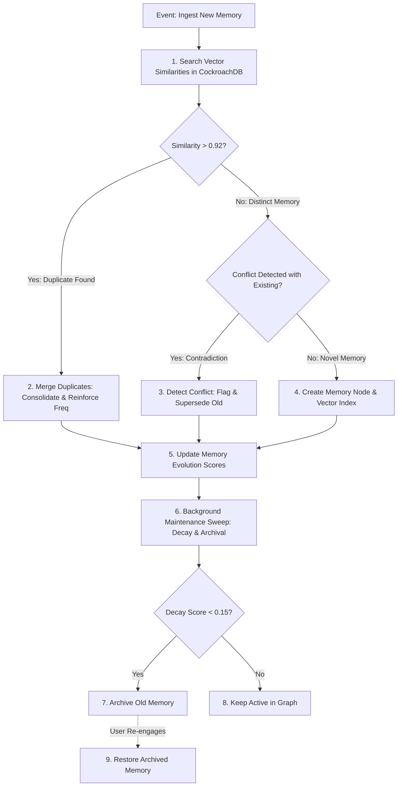

# Memory Evolution Engine Architecture: CareerDNA AI

**Component**: Memory Evolution & Maintenance Engine  
**Storage**: CockroachDB (Vector Index + Relational Graph)  
**Author**: Principal AI Memory Systems Architect  
**Status**: Production Ready  

---

## 1. Core Principles & Attributes

The **Memory Evolution Engine** is the brain of CareerDNA AI. Rather than keeping static, stale text notes, every career event, skill demonstration, interview outcome, and user reflection undergoes continuous memory evolution over time.

### 1.1 Memory Object Schema

Each memory unit is encapsulated with **10 core metadata attributes**:

| Attribute | Type | Description | Range / Values |
|---|---|---|---|
| **Importance ($I$)** | `float` | Subjective significance assigned by AI reasoning or explicit user pin | $0.00$ (trivial) to $1.00$ (vital milestone) |
| **Confidence ($C$)** | `float` | Degree of empirical proof backing the memory | $0.00$ (unverified assumption) to $1.00$ (verified proof) |
| **Frequency ($F$)** | `int` | Count of times this memory topic has been reinforced or referenced | $1$ to $\infty$ |
| **Recency ($t$)** | `float` | Elapsed time in days since memory was created or last reinforced | $0.0$ to $\infty$ (days) |
| **Decay Score ($S$)** | `float` | Computed effective retention weight combining time decay & importance | $0.00$ to $1.00$ |
| **Relationships ($R$)** | `List[Edge]` | Directed graph edges (`CAUSED_BY`, `IMPROVED_BY`, `SUPERSEDES`, `CONTRADICTS`) | Array of `(target_id, type, weight)` |
| **Source** | `string` | Ingestion origin | `'RESUME'`, `'GITHUB'`, `'INTERVIEW'`, `'REFLECTION'`, `'CERTIFICATE'` |
| **Embedding** | `VECTOR(1024)` | AWS Titan Embeddings V2 vector representation | $1024$-dimensional vector |
| **Status** | `enum` | Operational state of memory node in CockroachDB | `'ACTIVE'`, `'MERGED'`, `'ARCHIVED'`, `'CONFLICTED'` |
| **Summary** | `string` | Human-readable textual summary of memory event | Text string |

---

## 2. Mathematical Decay & Retention Algorithm

The retention score $S(t)$ of a memory unit at time $t$ (days elapsed since last reinforcement) is computed using a modified **Ebbinghaus Forgetting Curve** weighted by importance, confidence, and reinforcement frequency:

$$S(t) = \min\left(1.0, \, I \times C \times \left(1 + \beta \cdot \ln(F)\right) \times e^{-\lambda \cdot t}\right)$$

Where:
- $I$: Importance weight ($0.0 - 1.0$)
- $C$: Confidence score ($0.0 - 1.0$)
- $F$: Reinforcement frequency ($F \ge 1$)
- $\beta$: Frequency amplification constant ($\beta = 0.25$)
- $\lambda$: Half-life decay constant ($\lambda = 0.015$, corresponding to ~46 days half-life for unreinforced low-importance memories)
- $t$: Elapsed time in days since last reinforcement date.

If $S(t) < 0.15$ and $I < 0.80$, the memory is automatically transitioned to **`ARCHIVED`** status during background maintenance sweeps.

---

## 3. Core Engine Operations & Flow



---

## 4. Operational Algorithms & Pseudocode

### 4.1 Memory Creation & Vector Search
```python
def create_memory(user_id, source, raw_text, importance_weight):
    vector = generate_titan_embedding(raw_text)
    
    # Check for existing duplicate memory using CockroachDB HNSW vector index
    similar_memories = cockroach_vector_search(user_id, vector, threshold=0.92)
    
    if similar_memories:
        return merge_duplicates(primary_memory=similar_memories[0], new_text=raw_text)
        
    # Check for memory conflict (e.g. "Failed Python test" vs "Passed Python test")
    conflicting_memories = detect_conflicts(user_id, raw_text, vector)
    if conflicting_memories:
        resolve_conflict(existing_memories=conflicting_memories, new_text=raw_text)
        
    memory_id = cockroach_insert(
        user_id=user_id,
        source=source,
        summary=raw_text,
        importance=importance_weight,
        confidence=0.90,
        frequency=1,
        embedding=vector,
        status='ACTIVE'
    )
    return memory_id
```

### 4.2 Duplicate Merging Algorithm
When a new memory matches an existing active memory with cosine similarity $> 0.92$:
1. Increment frequency counter: $F_{\text{new}} \leftarrow F_{\text{existing}} + 1$.
2. Reset recency: $t \leftarrow 0$.
3. Boost confidence: $C_{\text{new}} \leftarrow \min(1.0, \, C_{\text{existing}} + 0.05)$.
4. Mark new duplicate entry as `STATUS = 'MERGED'` with a `SUPERSEDES` relationship edge pointing to the consolidated master memory.

### 4.3 Conflict Detection & Resolution
When new evidence directly contradicts existing active memory (e.g., old memory: "Failed AWS ML Exam", new input: "Passed AWS ML Exam"):
1. Set old memory `STATUS = 'CONFLICTED'`.
2. Add directed edge: `(new_memory_id) -[SUPERSEDES]-> (old_memory_id)`.
3. Lower confidence score of old memory to $C_{\text{old}} \leftarrow 0.20$.
4. Ensure new recommendation generation prioritizes the latest resolved state while explaining the transition.

### 4.4 Archival & Restoration Flow
- **Archival**: Background worker runs a cron sweep every 24 hours (`tasks` table). Any active memory with $S(t) < 0.15$ and $I < 0.80$ is transitioned to `STATUS = 'ARCHIVED'`.
- **Restoration**: If a user uploads a document or mentions a topic referencing an archived memory, the system executes vector search over *all* memory statuses (`ACTIVE` + `ARCHIVED`). If relevant match found, state transitions back to `STATUS = 'ACTIVE'`, $F \leftarrow F + 1$, and $t \leftarrow 0$.

---

## 5. RAG Hybrid Memory Retrieval Formula

When LangGraph requests memory context for prompt reasoning, retrieved memory candidates are ranked by a composite RAG relevance score $R_{\text{final}}$ combining Cosine Vector Similarity and Memory Retention Decay:

$$R_{\text{final}} = \alpha \cdot \text{CosineSimilarity}(\mathbf{q}, \mathbf{v}_m) + (1 - \alpha) \cdot S(t)$$

Where $\alpha = 0.70$, ensuring highly relevant semantic vector matches take priority while factoring in the recency and importance of user career milestones.
