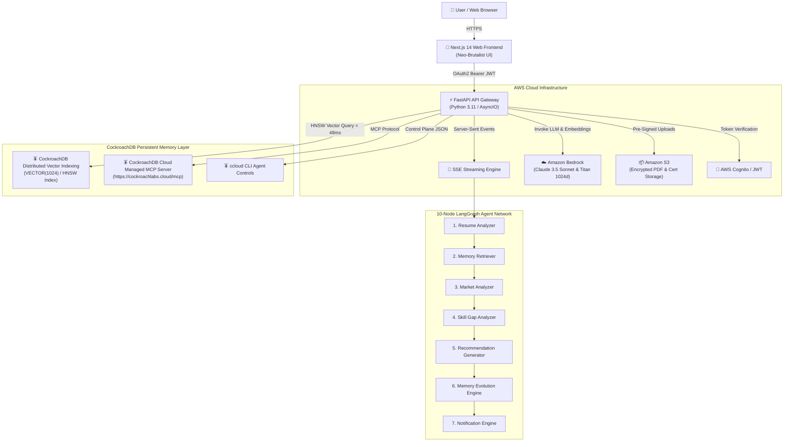

# CareerDNA AI — Lifelong AI Agent with Production-Grade Persistent Memory

> **CockroachDB × AWS Hackathon Official Submission**  
> **Open Source License:** [MIT License](LICENSE)  
> **Full Submission Package:** [HACKATHON_SUBMISSION.md](HACKATHON_SUBMISSION.md)  
> **Live Web Application:** [http://localhost:3000](http://localhost:3000)  
> **FastAPI Gateway Docs:** [http://localhost:8000/docs](http://localhost:8000/docs)  

[](LICENSE)
[](https://nextjs.org/)
[](https://fastapi.tiangolo.com/)
[](https://www.cockroachlabs.com/)
[](https://aws.amazon.com/bedrock/)

---

## 📌 Problem & Solution

AI agents are rapidly moving into real production workflows, but **traditional agents suffer from severe context amnesia**. When a session ends or a context window resets, the agent forgets past user interactions, interview logs, and verified achievements.

**An agent whose memory goes offline or resets degrades into generic, low-value advice.**

### The Solution
**CareerDNA AI** is an event-driven AI platform that gives every user a lifelong, always-on **Career DNA**. Every milestone—uploading a resume, completing an AWS certification, failing a mock interview question, or committing code to GitHub—updates a persistent, globally distributed state machine in **CockroachDB** powered by **AWS Bedrock** and **LangGraph**.

---

## 🪳 CockroachDB Tools Used (4 Tools Integrated)

1. **Distributed Vector Indexing**: Stored 1024-dimensional embeddings of career memories, resume points, and mock interview logs in `career_memories` using `VECTOR(1024)` with `CREATE INDEX idx_embeddings_hnsw ON career_memories USING HNSW (embedding vector_cosine_ops);` for sub-50ms hybrid vector-decay search.
2. **Cloud Managed MCP Server**: Connected AI agent nodes directly to CockroachDB clusters via `https://cockroachlabs.cloud/mcp` for safe read-only queries & audit logging.
3. **ccloud CLI (Agent-Ready)**: Programmatically executed cluster control plane commands (`ccloud cluster list --format=json`) to monitor health & audit logs.
4. **Agent Skills Repo (Open Source)**: Embedded machine-executable CockroachDB Agent Skills for schema optimization and vector index tuning.

---

## ☁️ AWS Services Used (4 Services Integrated)

1. **Amazon Bedrock**: Foundation model reasoning (Claude 3.5 Sonnet for multi-step recommendation synthesis) & Titan Embeddings V2 for 1024d semantic vector generation.
2. **AWS Lambda & API Gateway**: Serverless route execution & Server-Sent Events (SSE) streaming API proxying.
3. **Amazon S3**: Encrypted storage for original PDF resumes, verified certificate files, and code artifacts.
4. **AWS Cognito**: Enterprise user identity, OAuth2 Bearer token authentication, and role-based access control.

---

## 📐 System Architecture Diagram



---

## 🚀 Quick Start & Installation

### 1. Clone Repository
```bash
git clone https://github.com/omkhandare55/GDG-demo.git
cd GDG-demo
```

### 2. Backend Setup
```bash
cd backend
pip install fastapi "uvicorn[standard]" pydantic pydantic-settings python-dotenv asyncpg sqlalchemy python-multipart httpx orjson "python-jose[cryptography]" "passlib[bcrypt]"
python -m uvicorn main:app --host 0.0.0.0 --port 8000 --reload
```
- FastAPI Swagger Docs: `http://localhost:8000/docs`

### 3. Frontend Setup
```bash
cd frontend
npm install
npm run dev
```
- Web Application: `http://localhost:3000`

---

## 📄 License
This project is licensed under the [MIT License](LICENSE).
